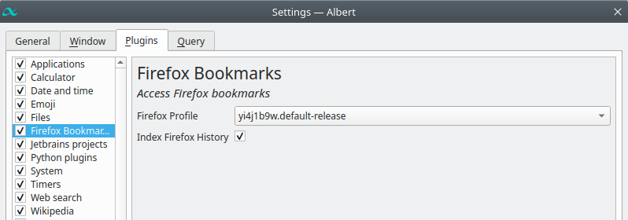

# Open Firefox Bookmarks and History in AlbertLauncher

This plugin/extension helps you open your **Firefox bookmarks and history** in [AlbertLauncher](https://albertlauncher.github.io/).

Albert will present the entries in frequency order: the more you use a bookmark, the higher it will be in the list.

## Features

- Open bookmarks and history from Firefox
- Select the Profile to use in the Preferences
- Enable or not the history search

## TODO

- [x] Index bookmarks
- [x] Index history (with preferences)
- [x] Select the profile to use
- [ ] (maybe) Select many profiles to index
- [ ] (complex) Favicon in the results (those are in another DB, need to extracted on disk...). 
  - See [Krunner SQL query](https://github.com/KDE/plasma-workspace/blob/96df482d06b8764c4348a98bf0cdc1bae91ab0eb/runners/bookmarks/faviconfromblob.cpp#L48)
  - See [Krunner download favicon](https://github.com/KDE/plasma-workspace/blob/96df482d06b8764c4348a98bf0cdc1bae91ab0eb/runners/bookmarks/faviconfromblob.cpp#L99)

## Setup

1. Make the plugin directory

```
mkdir -p ~/.local/share/albert/python/plugins/firefox/
```

2. Clone the repository

```
git clone https://github.com/tomsquest/albert_plugin_firefox_bookmarks.git ~/.local/share/albert/python/plugins/firefox_bookmarks
```

3. Enable the plugin in `Settings > Plugins` and tick `Firefox Bookmarks`


4. Configure the plugin by picking the Firefox profile to use and if you want to search in history



5. The default trigger is `f` (for Firefox), so start typing `f` in Albert to see your bookmarks and history

## Alternatives

- [Stevenxxiu plugin](https://github.com/stevenxxiu/albert_firefox)
- [Sagebind plugin](https://github.com/sagebind/dotfiles/blob/master/home.linux/.local/share/albert/python/plugins/firefoxbookmarks/__init__.py)
- [Official but archived C++ plugin](https://github.com/albertlauncher/plugins/tree/main/.archive/firefoxbookmarks)
